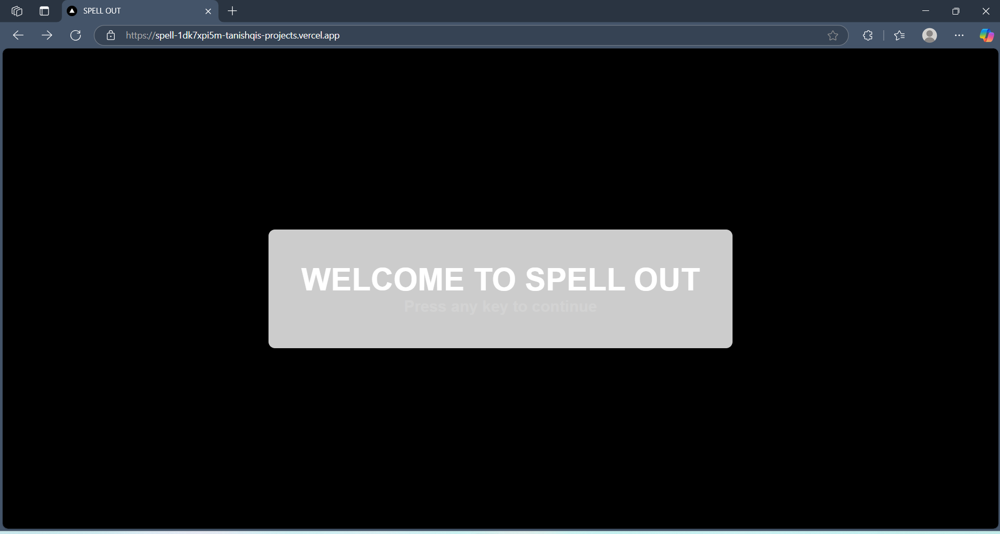
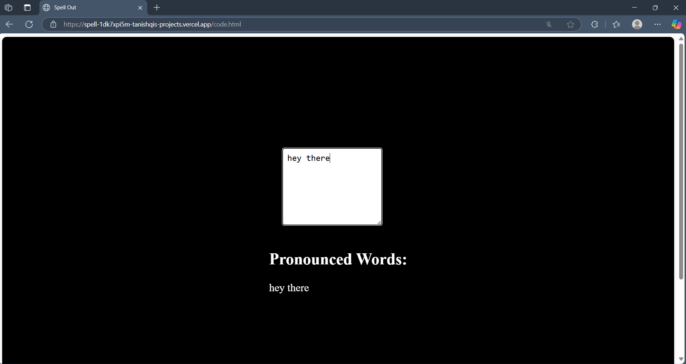

# 🔊 SpellOut

SpellOut is a front-end accessibility web project designed to help vision-impaired users and new language learners type more effectively by converting typed text into real-time spoken feedback.

## 🌐 Live Demo

👉 https://spell-out.vercel.app/

## 📁 Project Structure

```
📁 SPELL-OUT/
├── assets/
│   ├── Home-page.png
│   └── userInteface.png
├── scripts/
│   ├── dom.js
│   ├── page3.js
│   └── voicerecorder.js
├── styling/
│   ├── style.css
│   └── styling.css
├── .gitignore
├── code.html
├── index.html
└── vercel.json

```

## 🚀 Features

- 🔊 Real-time pronunciation for letters, words, and sentences

- 🧑‍🦿 Focused on accessibility for vision-impaired users

- 🌍 Designed to help new language learners

- 🗣️ Speech synthesis integrated using Web Speech API

## 🛠️ Tech Stack

- HTML5

- CSS3

- JavaScript

## 📸 Project Screenshots

Here is an example of how the project looks:




## 🧑‍💻 Cross-Browser Compatibility

- ✅ Best performance on Microsoft Edge

- ⚠️ Partial support on Google Chrome due to variations in speech synthesis behavior

- 🔧 Future updates will aim for consistent support across all browsers

## 📜 License

This project is licensed under the MIT License. You are free to use, modify, and distribute it under the terms of the license.

## 🌟 Fork and Star
If you found this project useful, consider **forking** and **starring** the repository to show your support!


